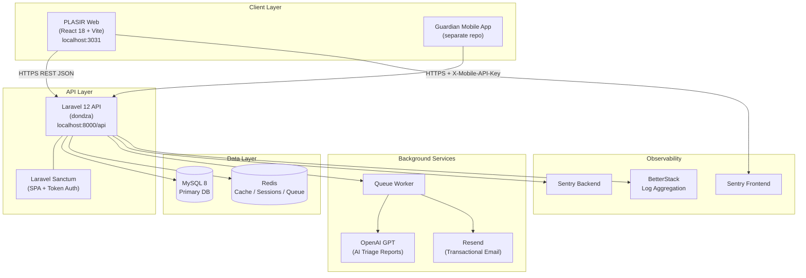
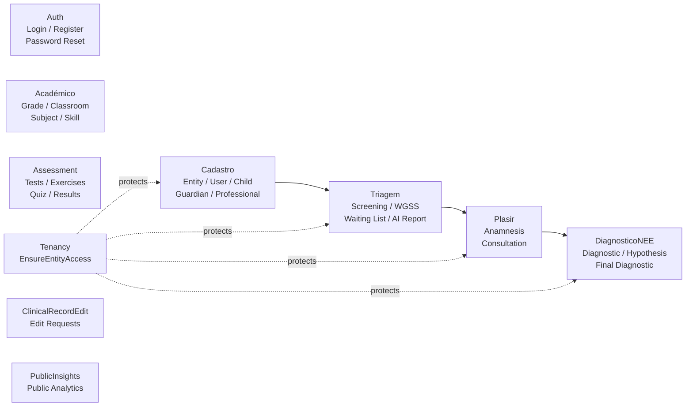
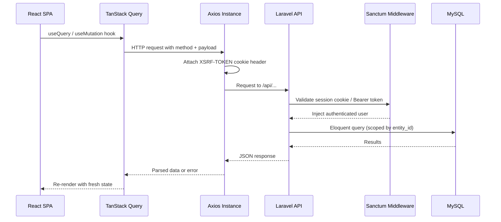
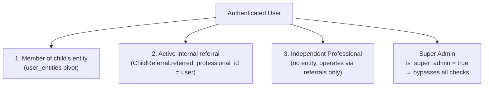

# 02 — Architecture & Technical Overview

## Table of Contents
- [High-Level Architecture](#high-level-architecture)
- [Technology Stack](#technology-stack)
- [Folder Structure](#folder-structure)
- [Key Design Patterns](#key-design-patterns)
- [Module Architecture](#module-architecture)
- [Third-Party Integrations](#third-party-integrations)
- [Frontend–Backend Communication Flow](#frontend-backend-communication-flow)
- [Multi-Tenancy Model](#multi-tenancy-model)

---

## High-Level Architecture



---

## Technology Stack

### Backend (`dondza`)

| Layer | Technology | Version |
|---|---|---|
| Language | PHP | ^8.2 |
| Framework | Laravel | ^12.0 |
| Authentication | Laravel Sanctum | ^4.2 |
| ORM | Eloquent | built-in |
| Database | MySQL (prod) / SQLite (dev) | 8.0+ |
| Cache / Sessions / Queue | Redis | 6.x+ |
| Email | Resend (`resend/resend-laravel`) | ^1.1 |
| AI | OpenAI API | GPT-5.4-mini |
| Error Tracking | Sentry (`sentry/sentry-laravel`) | ^4.24 |
| Log Aggregation | BetterStack (`logtail/monolog-logtail`) | ^3.3 |
| API Doc Gen | Scribe (`knuckleswtf/scribe`) | ^5.6 (dev) |
| Testing | PHPUnit | ^11.5.3 |
| Code Style | Laravel Pint | ^1.24 (dev) |

### Frontend (`dondza_cadastro`)

| Layer | Technology | Version |
|---|---|---|
| Language | JavaScript (JSX) | ES2022+ |
| Framework | React | ^18.3.1 |
| Build Tool | Vite (SWC) | ^5.4.2 |
| UI Library | MUI v5 | ^5.16.7 |
| Data Grids | MUI X Data Grid | ^7.13.0 |
| Server State | TanStack React Query | ^5.90.16 |
| Routing | React Router v6 | ^6.26.1 |
| Forms | React Hook Form + Zod | ^7 / ^3 |
| HTTP Client | Axios | ^1.7.4 |
| Rich Text | Tiptap | ^2.10.3 |
| Charts | ApexCharts | ^5.3.5 |
| Maps | Mapbox GL + react-map-gl | ^3 / ^8 |
| PDF Export | jsPDF + autotable | ^3.0.3 |
| Excel Export | xlsx | ^0.18.5 |
| i18n | i18next | ^23.15.1 |
| Animation | Framer Motion | ^11.3.29 |
| Error Tracking | Sentry React | ^10.47.0 |
| Testing | Vitest + Testing Library | ^4.1.2 |
| Linting | ESLint (Airbnb) | ^8.57.0 |
| Formatting | Prettier | ^3.3.3 |

---

## Folder Structure

### Backend (`dondza/`)

```
dondza/
├── app/
│   ├── Console/          # Artisan commands
│   ├── Http/
│   │   ├── Controllers/  # Assessment controllers
│   │   ├── Middleware/   # EnsureSuperAdmin, EnsureMobileApiKey, AttachRequestContext
│   │   └── Requests/     # Form request validators
│   ├── Jobs/             # Queued jobs (AI reports, emails)
│   ├── Models/           # Eloquent models, namespaced by domain
│   ├── Modules/          # 10 domain modules (see below)
│   ├── Notifications/    # Email notifications
│   ├── Observers/        # Model lifecycle hooks
│   ├── Policies/         # Resource authorization (Child, Triage, Referral)
│   └── Services/         # Shared services (Core, Email, RUP)
├── database/
│   ├── migrations/       # 98 migration files (Dec 2025 – May 2026)
│   ├── seeders/
│   └── factories/
├── routes/
│   ├── api.php           # 387-line API route file
│   └── console.php       # Scheduled commands
└── tests/
    ├── Feature/          # HTTP integration tests
    ├── Performance/
    └── Unit/
```

### Frontend (`dondza_cadastro/`)

```
dondza_cadastro/
├── src/
│   ├── auth/             # JWT context, guards, login views
│   ├── components/       # Reusable UI components
│   ├── hooks/            # Shared custom hooks
│   ├── layouts/          # Dashboard & auth layouts
│   ├── locales/          # i18n translations (pt, en)
│   ├── pages/            # Route-level page components
│   ├── routes/           # paths.js, route configs, route hooks
│   ├── sections/         # Feature views (16 domains)
│   ├── services/         # Axios API service layer
│   ├── theme/            # MUI theme overrides
│   └── utils/            # Shared utilities & Axios instance
└── vite.config.js        # Code splitting, Sentry plugin, port 3031
```

---

## Key Design Patterns

### Backend

| Pattern | Location | Purpose |
|---|---|---|
| **Modular Monolith** | `app/Modules/` | Domain isolation, 10 bounded contexts |
| **Use Cases** | `Modules/*/UseCases/` | Single-responsibility business logic |
| **Query Objects** | `Modules/*/Queries/` | Complex DB queries decoupled from controllers |
| **Form Requests** | `Modules/*/Requests/` | Input validation isolated from controllers |
| **Service Layer** | `app/Services/`, `Modules/*/Services/` | Cross-cutting concerns (email, AI, RUP) |
| **Observer Pattern** | `app/Observers/` | Side effects on Eloquent model events |
| **Policy-Based Auth** | `app/Policies/` | Resource-level access (ChildPolicy, etc.) |
| **Soft Deletes** | Children model | Trash / restore for student records |
| **Feature Flags** | `.env` booleans | Safe rollout of ownership rules, AI features |
| **Named Rate Limiting** | Routes | Abuse prevention (login, quiz, location) |

### Frontend

| Pattern | Location | Purpose |
|---|---|---|
| **Server State** | TanStack React Query | API caching, refetch, loading states |
| **Context API** | `auth/context/JwtContext` | Global auth state |
| **Guard Components** | `auth/guard/AuthGuard` | Route-level auth & role protection |
| **Custom Hooks** | `src/hooks/` | Encapsulate query logic per feature |
| **Code Splitting** | `vite.config.js manualChunks` | Lazy-load maps, charts, PDF, editor |

---

## Module Architecture



---

## Third-Party Integrations

| Service | Purpose | Config Variables |
|---|---|---|
| **OpenAI** | AI triage assessment narrative reports | `OPENAI_API_KEY`, `OPENAI_MODEL` |
| **Resend** | Welcome email, password setup, email verification | `RESEND_API_KEY` |
| **Sentry (BE)** | Backend error tracking & performance | `SENTRY_LARAVEL_DSN`, `SENTRY_TRACES_SAMPLE_RATE` |
| **Sentry (FE)** | JS error tracking, sourcemap upload | `VITE_SENTRY_DSN`, `SENTRY_AUTH_TOKEN` |
| **BetterStack** | Log aggregation (Monolog Logtail handler) | `BETTER_STACK_SOURCE_TOKEN` |
| **Mapbox GL** | Geographic equity map visualisation | `VITE_MAPBOX_API_KEY` |
| **Redis** | Cache, session store, job queue | `REDIS_HOST`, `REDIS_PASSWORD` |

---

## Frontend–Backend Communication Flow



**Key Axios configuration:**
- Base URL: `CONFIG.apiBaseUrl` from `PP_SERVER_URL` env var
- Auth: Sanctum SPA cookie-based (no explicit `Authorization` header for web)
- CSRF: Automatic `X-XSRF-TOKEN` injection from `XSRF-TOKEN` cookie
- Error interceptor: Global 401 → redirect to login page

---

## Multi-Tenancy Model

The system uses **soft multi-tenancy** (shared database, scoped queries).

### Access Origins (3 legitimate paths)



**`EnsureEntityAccess` middleware** resolves access from any of the 3 origins:
1. **Entity membership** — `user_entities` pivot contains `(user_id, entity_id)` row
2. **Active referral** — `ChildReferral` with `referred_professional_id = $user->id` grants scoped child access
3. **Independent professional** — professional with zero entity memberships; list is auto-scoped to referred children via `TenancyService`

A child always retains its **origin `entity_id`** — referral access is temporary and scoped, not ownership transfer.

**`EnsureSuperAdmin` middleware**: gates admin mutations; bootstraps the first super admin if none exists yet (initial system setup).

### CORS Configuration

```php
// config/cors.php
'paths'               => ['api/*', 'sanctum/csrf-cookie'],
'allowed_methods'     => ['*'],
'allowed_origins'     => env('CORS_ALLOWED_ORIGINS'),   // explicit whitelist
'allowed_headers'     => ['*'],
'max_age'             => 86400,   // Cache preflight 24h → reduces OPTIONS requests
'supports_credentials'=> true,    // Required for Sanctum SPA cookie auth
```

### Ownership V2 Feature Flag

```php
// config/ownership.php
'child_access_v2_enabled' => env('OWNERSHIP_CHILD_ACCESS_V2_ENABLED', false)
```

When `true`, `TenancyService` delegates child access rules to `ChildAccessService` (ownership + referrals + principal). When `false`, uses legacy rollback-safe behaviour.
