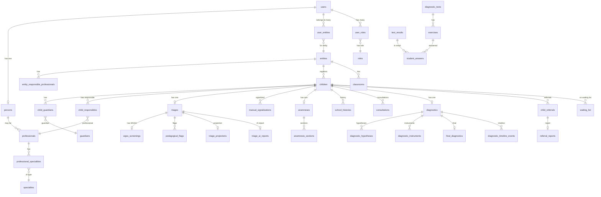

# 04 — Database Schema

## Table of Contents
- [Overview](#overview)
- [ER Diagram](#er-diagram)
- [Schema: Core & Auth](#schema-core--auth)
- [Schema: RUP — Pessoa](#schema-rup--pessoa)
- [Schema: Cadastro](#schema-cadastro)
- [Schema: Académico](#schema-académico)
- [Schema: Triagem / Screening](#schema-triagem--screening)
- [Schema: Plasir — Anamnesis](#schema-plasir--anamnesis)
- [Schema: DiagnosticoNEE](#schema-diagnosticonee)
- [Schema: Assessment](#schema-assessment)
- [Schema: System Tables](#schema-system-tables)
- [Indexes & Optimization](#indexes--optimization)
- [Migration History Summary](#migration-history-summary)

---

## Overview

- **Database:** MySQL 8.0+ (production), SQLite (local dev)
- **ORM:** Laravel Eloquent with UUID primary keys
- **Soft Deletes:** Applied to `children` (trash/restore workflow)
- **Tenancy:** Most domain tables carry `entity_id` (FK to `entities`)
- **Total migrations:** 98 files (December 2025 – May 2026)

---

## ER Diagram

---

## Schema: Core & Auth

### `users`

| Column | Type | Constraints | Description |
|---|---|---|---|
| `id` | `uuid` | PK | UUID primary key |
| `email` | `varchar` | UNIQUE, NOT NULL | Login email |
| `password_hash` | `varchar` | NOT NULL | Bcrypt hash (12 rounds) |
| `email_verified_at` | `timestamp` | nullable | Email verification timestamp |
| `main_role` | `varchar` | nullable | Denormalised primary role label |
| `is_super_admin` | `boolean` | default false | Global admin flag |
| `is_active` | `boolean` | default true | Account active state |
| `must_change_password` | `boolean` | default false | Force password change on next login |
| `remember_token` | `varchar(100)` | nullable | Remember-me token |
| `created_at` | `timestamp` | | |
| `updated_at` | `timestamp` | | |

### `roles`

| Column | Type | Description |
|---|---|---|
| `id` | `bigint` PK | |
| `name` | `varchar` UNIQUE | e.g. `super_admin`, `professional`, `teacher`, `guardian` |
| `description` | `text` nullable | |
| `created_at` / `updated_at` | `timestamp` | |

### `user_entities` (pivot)

| Column | Type | Description |
|---|---|---|
| `id` | `bigint` PK | |
| `user_id` | `uuid` FK → users | |
| `entity_id` | `uuid` FK → entities | |
| `is_lead_specialist` | `boolean` default false | Lead specialist flag per entity |
| `created_at` / `updated_at` | `timestamp` | |

### `user_roles`

| Column | Type | Description |
|---|---|---|
| `id` | `bigint` PK | |
| `user_id` | `uuid` FK → users | |
| `role_id` | `bigint` FK → roles | |
| `entity_id` | `uuid` FK → entities, nullable | Scoped role or global |
| `created_at` / `updated_at` | `timestamp` | |

### `personal_access_tokens`

Standard Laravel Sanctum tokens table (tokenable_id is UUID).

### `password_reset_tokens`

| Column | Type | Description |
|---|---|---|
| `email` | `varchar` PK | |
| `token` | `varchar` | Hashed reset token |
| `created_at` | `timestamp` | |

---

## Schema: RUP — Pessoa

### `persons`

| Column | Type | Description |
|---|---|---|
| `id` | `bigint` PK | |
| `user_id` | `uuid` FK → users, nullable | Linked user account |
| `first_name` | `varchar` | |
| `last_name` | `varchar` | |
| `id_number` | `varchar` nullable | National ID / BI |
| `province_id` | `FK` nullable | Geographic location |
| `district_id` | `FK` nullable | |
| `neighborhood_id` | `FK` nullable | |
| `latitude` | `decimal` nullable | Geo coordinates |
| `longitude` | `decimal` nullable | |
| `created_at` / `updated_at` | `timestamp` | |

---

## Schema: Cadastro

### `entities`

| Column | Type | Description |
|---|---|---|
| `id` | `uuid` PK | |
| `name` | `varchar` | Organisation/school name |
| `code_prefix` | `varchar` nullable | Short code (e.g., `EPC`) |
| `province_id` | `FK` nullable | |
| `district_id` | `FK` nullable | |
| `latitude` / `longitude` | `decimal` nullable | Geo coordinates |
| `created_at` / `updated_at` | `timestamp` | |

### `professionals`

| Column | Type | Description |
|---|---|---|
| `id` | `uuid` PK | |
| `person_id` | `FK → persons` | |
| `entity_id` | `uuid` FK → entities | Primary entity |
| `created_at` / `updated_at` | `timestamp` | |

### `specialties`

| Column | Type | Description |
|---|---|---|
| `id` | `bigint` PK | |
| `name` | `varchar` | e.g., `Psicologia`, `Fonoaudiologia` |
| `slug` | `varchar` UNIQUE | URL-safe identifier |

### `professional_specialities` (pivot)

| Column | Type | Description |
|---|---|---|
| `professional_id` | `uuid` FK | |
| `specialty_id` | `bigint` FK | |

### `entity_responsible_professionals`

| Column | Type | Description |
|---|---|---|
| `id` | `bigint` PK | |
| `entity_id` | `uuid` FK | |
| `user_id` | `uuid` FK → users | |
| `specialty_id` | `bigint` FK nullable | |
| `created_at` / `updated_at` | `timestamp` | |

### `children`

| Column | Type | Description |
|---|---|---|
| `id` | `uuid` PK | |
| `entity_id` | `uuid` FK → entities | Owning school |
| `created_by` | `uuid` FK → users, nullable | Who created the record |
| `first_name` | `varchar` | |
| `last_name` | `varchar` | |
| `birth_date` | `date` nullable | |
| `gender` | `varchar` nullable | |
| `province_id` / `district_id` / `neighborhood_id` | FK nullable | |
| `latitude` / `longitude` | `decimal` nullable | |
| `owner_entity_id` | `uuid` nullable | Ownership v2 field |
| `owner_user_id` | `uuid` nullable | Ownership v2 field |
| `deleted_at` | `timestamp` nullable | Soft delete |
| `created_at` / `updated_at` | `timestamp` | |

### `guardians`

| Column | Type | Description |
|---|---|---|
| `id` | `uuid` PK | |
| `user_id` | `uuid` FK → users | Associated user account |
| `entity_id` | `uuid` nullable | Optional entity scoping |
| `relationship` | `varchar` nullable | e.g., `parent`, `sibling` |
| `created_at` / `updated_at` | `timestamp` | |

### `child_guardians` (pivot)

| Column | Type | Description |
|---|---|---|
| `child_id` | `uuid` FK | |
| `guardian_id` | `uuid` FK | |
| `relationship` | `varchar` nullable | Relationship type |

### `child_responsibles`

| Column | Type | Description |
|---|---|---|
| `id` | `bigint` PK | |
| `child_id` | `uuid` FK | |
| `professional_id` | `uuid` FK | Responsible professional |
| `entity_id` | `uuid` FK | |

---

## Schema: Académico

### `grades`

| Column | Type | Description |
|---|---|---|
| `id` | `bigint` PK | |
| `name` | `varchar` | e.g., `1ª Classe` |
| `level` | `int` | Numeric order |

### `classrooms`

| Column | Type | Description |
|---|---|---|
| `id` | `uuid` PK | |
| `entity_id` | `uuid` FK | |
| `grade_id` | `bigint` FK | |
| `teacher_id` | `uuid` FK → users, nullable | |
| `name` | `varchar` | Classroom label |
| `year` | `int` | Academic year |

### `subject_bases` / `subjects` / `skills` / `competences`

Hierarchical academic content taxonomy:
- `subject_bases` → `subjects` (grouped by base)
- `skills` → `competences` (competences reference skills)

### `school_histories`

| Column | Type | Description |
|---|---|---|
| `id` | `bigint` PK | |
| `child_id` | `uuid` FK | |
| `entity_id` | `uuid` FK | |
| `grade_id` | `bigint` FK | |
| `classroom_id` | `uuid` FK nullable | |
| `home_language` | `varchar` nullable | |
| `other_home_language` | `varchar` nullable | |
| `year` | `int` | |
| `created_at` / `updated_at` | `timestamp` | |

---

## Schema: Triagem / Screening

### `triages`

| Column | Type | Description |
|---|---|---|
| `id` | `uuid` PK | |
| `child_id` | `uuid` FK UNIQUE | One triage per child |
| `entity_id` | `uuid` FK | |
| `screened_by` | `uuid` FK → users | |
| `form_data` | `json` | Full PLASIR triage form payload |
| `status` | `varchar` | `pending` / `completed` / etc. |
| `persisted_status` | `varchar` nullable | Denormalised computed status |
| `created_at` / `updated_at` | `timestamp` | |

### `wgss_screenings`

Stores the Washington Group Short Set disability screening answers (vision, hearing, mobility, cognition, communication, self-care, mental health fields added later).

### `pedagogical_flags`

Flags raised during triage for pedagogical concerns.

### `triage_projections`

Pre-computed projection/summary of triage results for fast dashboard queries.

### `triage_ai_reports`

| Column | Type | Description |
|---|---|---|
| `id` | `bigint` PK | |
| `child_id` | `uuid` FK UNIQUE | |
| `entity_id` | `uuid` FK | |
| `status` | `varchar` | `pending` / `completed` / `failed` |
| `prompt_version` | `varchar` | Prompt template used |
| `schema_version` | `varchar` | Response schema version |
| `report_data` | `json` nullable | Generated AI report content |
| `error_message` | `text` nullable | Failure reason |
| `created_at` / `updated_at` | `timestamp` | |

### `manual_signalizations`

| Column | Type | Description |
|---|---|---|
| `id` | `uuid` PK | |
| `child_id` | `uuid` FK | |
| `entity_id` | `uuid` FK | |
| `signalized_by` | `uuid` FK → users | |
| `concern_areas` | `json` nullable | Areas of concern |
| `summary` | `text` nullable | |
| `created_at` / `updated_at` | `timestamp` | |

### `waiting_list`

| Column | Type | Description |
|---|---|---|
| `id` | `bigint` PK | |
| `child_id` | `uuid` FK | |
| `entity_id` | `uuid` FK | |
| `priority` | `varchar` | `low` / `medium` / `high` |
| `status` | `varchar` | `open` / `closed` |
| `lead_specialist_id` | `uuid` FK → users nullable | |
| `closed_at` | `timestamp` nullable | |
| `created_at` / `updated_at` | `timestamp` | |

### `referrals`

| Column | Type | Description |
|---|---|---|
| `id` | `uuid` PK | |
| `child_id` | `uuid` FK | |
| `entity_id` | `uuid` FK | |
| `referring_professional_id` | `uuid` FK → users | |
| `referred_professional_id` | `uuid` FK → users, nullable | |
| `hypothesis_id` | `uuid` FK → diagnostic_hypotheses, nullable | |
| `status` | `varchar` | `pending` / `returned` / `completed` |
| `clinical_notes` | `text` nullable | |
| `created_at` / `updated_at` | `timestamp` | |

### `referral_reports`

| Column | Type | Description |
|---|---|---|
| `id` | `uuid` PK | |
| `referral_id` | `uuid` FK UNIQUE | |
| `authored_by` | `uuid` FK → users | |
| `investigation_data` | `json` nullable | Structured report content |
| `submitted_at` | `timestamp` nullable | |
| `created_at` / `updated_at` | `timestamp` | |

---

## Schema: Plasir — Anamnesis

### `anamneses`

| Column | Type | Description |
|---|---|---|
| `id` | `uuid` PK | |
| `child_id` | `uuid` FK UNIQUE | One anamnesis per child |
| `entity_id` | `uuid` FK | |
| `anamnesis_by` | `uuid` FK → users | |
| `initial_assessment_summary` | `json` nullable | |
| `status` | `varchar` | |
| `created_at` / `updated_at` | `timestamp` | |

### `anamnesis_sections`

| Column | Type | Description |
|---|---|---|
| `id` | `bigint` PK | |
| `anamnesis_id` | `uuid` FK | |
| `section_key` | `varchar` | e.g., `gestacao`, `desenvolvimento`, `familia` |
| `data` | `json` | Section form data |

### `consultations`

| Column | Type | Description |
|---|---|---|
| `id` | `uuid` PK | |
| `child_id` | `uuid` FK | |
| `entity_id` | `uuid` FK | |
| `professional_id` | `uuid` FK → users | |
| `notes` | `text` nullable | |
| `consultation_date` | `date` | |
| `created_at` / `updated_at` | `timestamp` | |

---

## Schema: DiagnosticoNEE

### `diagnostics`

| Column | Type | Description |
|---|---|---|
| `id` | `uuid` PK | |
| `child_id` | `uuid` FK UNIQUE | One diagnostic per child |
| `entity_id` | `uuid` FK | |
| `status` | `varchar` | `in_progress` / `completed` |
| `created_at` / `updated_at` | `timestamp` | |

### `diagnostic_hypotheses`

| Column | Type | Description |
|---|---|---|
| `id` | `uuid` PK | |
| `diagnostic_id` | `uuid` FK | |
| `specialty_id` | `bigint` FK → specialties | |
| `professional_id` | `uuid` FK → users | Assigned specialist |
| `hypothesis` | `text` | Clinical hypothesis text |
| `confidence_level` | `varchar` nullable | |
| `specialist_diagnosis` | `text` nullable | |
| `investigation_fields` | `json` nullable | Investigation data |
| `created_at` / `updated_at` | `timestamp` | |

### `diagnostic_instruments`

| Column | Type | Description |
|---|---|---|
| `id` | `uuid` PK | |
| `diagnostic_id` | `uuid` FK | |
| `name` | `varchar` | Instrument name |
| `type` | `varchar` | Instrument type |
| `results` | `json` nullable | |
| `applied_by` | `uuid` FK → users | |
| `applied_at` | `date` nullable | |

### `final_diagnostics`

| Column | Type | Description |
|---|---|---|
| `id` | `uuid` PK | |
| `diagnostic_id` | `uuid` FK UNIQUE | |
| `specialty_data` | `json` nullable | |
| `professional_responsible_id` | `uuid` FK → users, nullable | |
| `detailed_fields` | `json` nullable | |
| `finalized_at` | `timestamp` nullable | |

### `child_referrals`

Inter-entity child referrals (different from specialist-to-specialist `referrals` table).

### `diagnostic_timeline_events`

| Column | Type | Description |
|---|---|---|
| `id` | `uuid` PK | |
| `diagnostic_id` | `uuid` FK | |
| `event_type` | `varchar` | Type of event logged |
| `description` | `text` nullable | |
| `happened_at` | `timestamp` | |
| `logged_by` | `uuid` FK → users | |

### `clinical_record_edit_requests`

Workflow for requesting edits to locked clinical records.

---

## Schema: Assessment

### `diagnostic_tests`

| Column | Type | Description |
|---|---|---|
| `id` | `uuid` PK | |
| `entity_id` | `uuid` FK, nullable | Null = global test |
| `title` | `varchar` | |
| `description` | `text` nullable | |
| `is_published` | `boolean` default false | |
| `is_global` | `boolean` default false | |
| `created_at` / `updated_at` | `timestamp` | |

### `exercises`

| Column | Type | Description |
|---|---|---|
| `id` | `uuid` PK | |
| `test_id` | `uuid` FK | |
| `skill_id` | `bigint` FK, nullable | |
| `question` | `text` | |
| `options` | `json` | Answer choices |
| `correct_answer` | `varchar` | |
| `question_audio_url` | `varchar` nullable | Audio for accessibility |
| `created_at` / `updated_at` | `timestamp` | |

### `test_results`

| Column | Type | Description |
|---|---|---|
| `id` | `uuid` PK | |
| `test_id` | `uuid` FK | |
| `child_id` | `uuid` FK | |
| `entity_id` | `uuid` FK | |
| `started_at` | `timestamp` | |
| `completed_at` | `timestamp` nullable | |
| `score` | `decimal` nullable | Computed score |

### `student_answers`

| Column | Type | Description |
|---|---|---|
| `id` | `bigint` PK | |
| `result_id` | `uuid` FK → test_results | |
| `exercise_id` | `uuid` FK | |
| `answer` | `varchar` | Student's answer |
| `is_correct` | `boolean` | |
| `answered_at` | `timestamp` | |

---

## Schema: System Tables

| Table | Purpose |
|---|---|
| `cache` | Laravel database cache |
| `jobs` | Laravel job queue |
| `failed_jobs` | Failed queue jobs log |
| `sessions` | Database session store |
| `provinces` | Mozambican provinces (11 provinces) |
| `districts` | Mozambican districts |
| `mozambique_locations` | Neighborhoods with district FK |

---

## Indexes & Optimization

### Performance Indexes Added (via dedicated migration)

| Table | Indexed Columns | Purpose |
|---|---|---|
| `users` | `email`, `is_active`, `is_super_admin` | Fast auth lookups |
| `user_entities` | `(user_id, entity_id)` composite | Tenant access check |
| `user_roles` | `(user_id, entity_id)` | Role resolution |
| `children` | `entity_id`, `deleted_at` | Scoped list queries |
| `triages` | `child_id` (UNIQUE), `entity_id` | One-per-child constraint |
| `anamneses` | `child_id` (UNIQUE), `entity_id` | One-per-child constraint |
| `diagnostics` | `child_id` (UNIQUE), `entity_id` | One-per-child constraint |
| `test_results` | `(test_id, child_id)`, `entity_id` | Quiz lookup |
| `student_answers` | `(result_id, exercise_id)` | Answer lookup |
| `triage_projections` | `child_id`, `entity_id` | Dashboard fast path |
| `waiting_list` | `entity_id`, `status`, `priority` | Filtered list queries |

### Key Constraints

- `triages.child_id` — UNIQUE (one triage per child)
- `anamneses.child_id` — UNIQUE (one anamnesis per child)
- `diagnostics.child_id` — UNIQUE (one diagnostic per child)
- `triage_ai_reports.child_id` — UNIQUE
- `referral_reports.referral_id` — UNIQUE (one report per referral)
- `final_diagnostics.diagnostic_id` — UNIQUE

---

## Migration History Summary

| Period | Key Changes |
|---|---|
| **Dec 2025 (initial)** | Core schema: users, entities, roles, persons, children, guardians, triages, WGSS, anamneses, diagnostics, assessment tables |
| **Dec 2025 (mid)** | Geographic fields (provinces, districts, neighborhoods), performance indexes, UUID tokenable migration |
| **Jan 2026** | Entity responsible professionals, consultation table, specialty data on final diagnostics, ownership fields on children |
| **Feb 2026** | Nullable entity_id on guardians, nullable professional_responsible on final diagnostics |
| **Mar 2026** | Manual signalizations table, mental health WGSS fields, school history fields, lead specialist flag on user_entities, waiting list tables, referrals & referral reports |
| **Apr 2026** | Clinical record edit requests, persisted triage status, triage projections, pre-Redis performance indexes, unique child constraints on triages/anamneses, AI report table |
| **May 2026** | Relationship field on child_guardians, nullable relationship on guardians |
