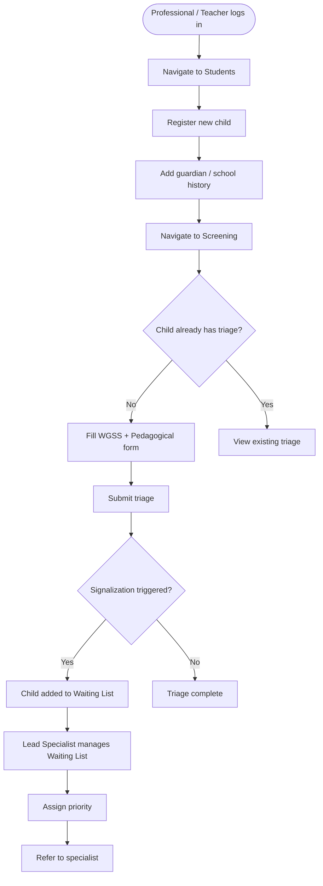
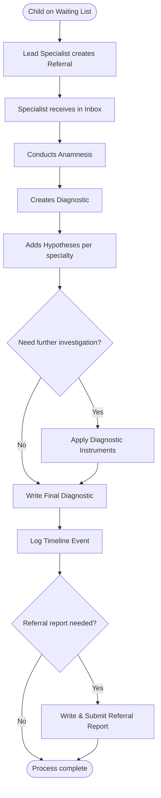
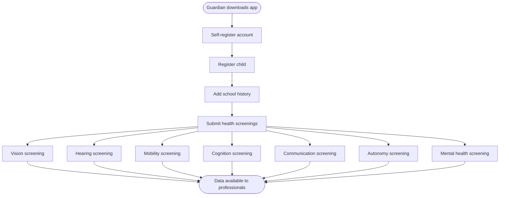
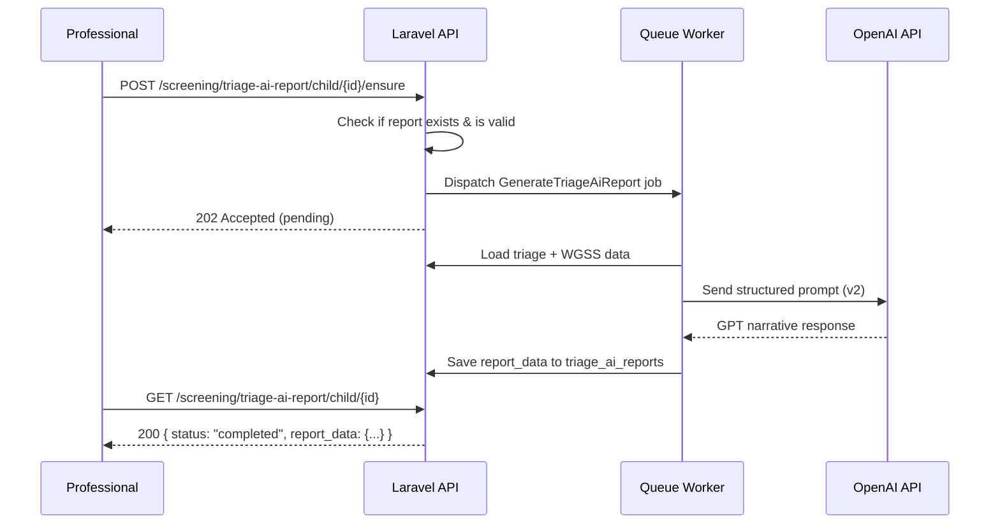
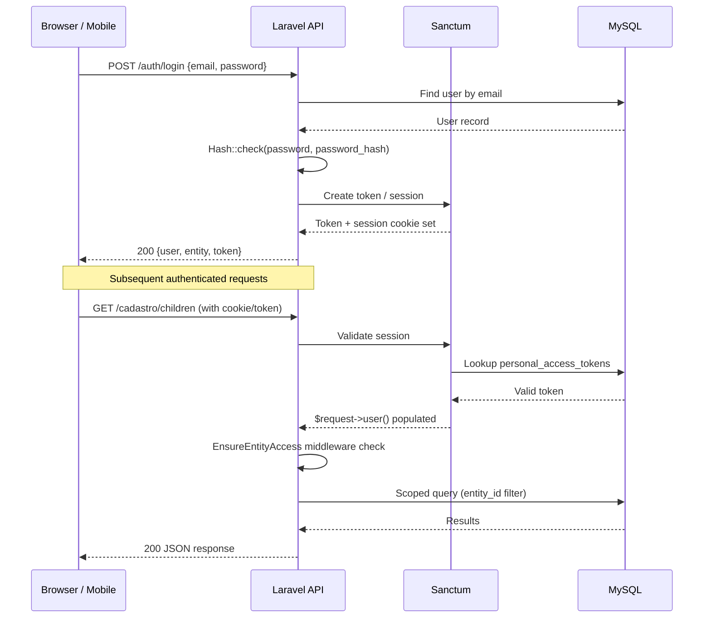
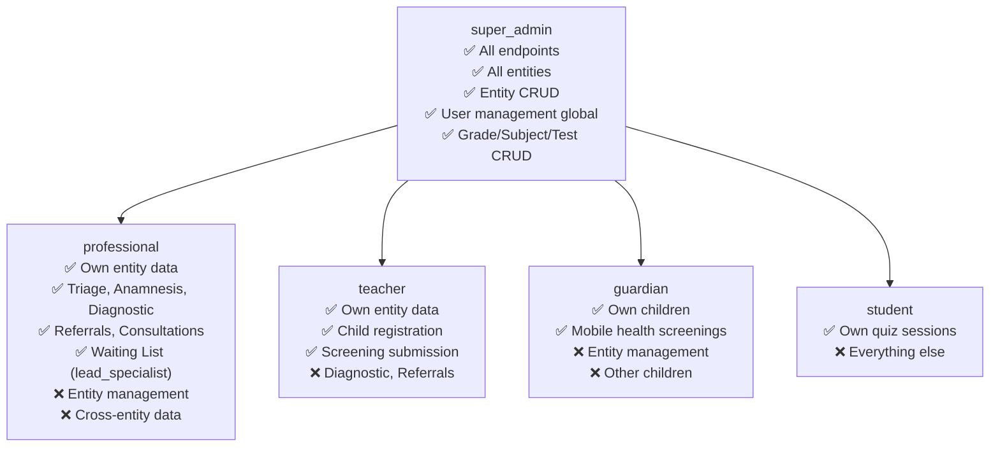

# 05 — Features & User Journey

## Table of Contents
- [System Overview](#system-overview)
- [User Roles](#user-roles)
- [Feature List](#feature-list)
- [User Flow Diagrams](#user-flow-diagrams)
- [Authentication & Authorization Flow](#authentication--authorization-flow)
- [Role-Based Access Control](#role-based-access-control)
- [Key User Stories](#key-user-stories)

---

## System Overview

**PLASIR** (Plataforma de Sinalização e Intervenção em Risco) is a multi-tenant educational health platform for Mozambique. It enables schools and health professionals to:

1. **Register** students (children) and their guardians
2. **Screen** students for functional difficulties (WGSS + pedagogical flags)
3. **Signalize** students needing intervention
4. **Manage** a waiting list of signalized students
5. **Refer** students between specialists
6. **Conduct** clinical anamnesis and consultations
7. **Diagnose** NEE (Necessidades Educativas Especiais)
8. **Assess** students via structured tests and quizzes
9. **Report** with AI-assisted triage narratives and geographic equity maps

---

## User Roles

| Role | Scope | Capabilities |
|---|---|---|
| **super_admin** | Global (all entities) | Full system access: manage entities, users, grades, tests; view all data |
| **professional** | Entity-scoped | Triage, anamnesis, diagnosis, referrals, consultations |
| **teacher** | Entity-scoped | Register children, submit screenings |
| **lead_specialist** | Entity-scoped flag | Manage waiting list, oversee referrals in their entity |
| **guardian** | Own children only | Mobile app: register children, submit health screenings |
| **student** | Own quiz sessions | Take published assessment quizzes |

---

## Feature List

### ✅ Authentication & Account Management
- JWT-based SPA login (email + password)
- Password setup via email link (welcome flow)
- Forgot password / password reset via email
- Email verification
- Mobile login with `X-Mobile-API-Key` header
- Entity switching (multi-entity users)
- Force password change on first login (`must_change_password`)
- Session management via Sanctum

### ✅ Entity (School / Organisation) Management
- Create, update, delete entities (super admin)
- Geographic coordinates and province/district assignment
- Entity code prefix for student code generation
- Entity statistics dashboard
- Assign responsible professionals to entities

### ✅ User Management
- Create, edit, soft-delete users per entity
- Role assignment (professional, teacher, etc.)
- Lead specialist designation per entity
- Resend welcome / verification email
- Force delete with audit trail

### ✅ Student (Child) Registration
- Full child profile: name, birth date, gender, geographic location
- Soft delete (trash) with restore capability
- School history tracking (grade, classroom, language)
- Guardian linkage (one-to-many)
- Professional responsible assignment
- Ownership tracking (v2 feature flag)

### ✅ Guardian Registration (App + Web)
- Guardian self-registration via mobile app
- Guardian linked to children
- Guardian account type (separate from professional users)

### ✅ Screening / Triagem (WGSS + Pedagogical)
- One structured triage per child (enforced by DB UNIQUE constraint)
- Washington Group Short Set (WGSS) disability screening
- Mental health screening domain (added Mar 2026)
- Pedagogical flags raised during screening
- Triage dashboard & stats per entity
- Persisted/denormalised status for fast queries
- Triage projections for analytical views

### ✅ Universal Triage Analytics Dashboard (5 tabs)
- **Overview**: aggregate KPIs across entity
- **Functional Profile**: breakdown by disability domain
- **Question Analysis**: per-question response distribution
- **Equidade**: geographic equity map (Mapbox)
- **Risk Profiles**: risk classification distribution

### ✅ AI Triage Reports
- GPT-generated narrative assessment report per child
- Async job generation (queue-backed)
- Retry on failure
- Versioned prompt templates (`TRIAGE_AI_PROMPT_VERSION=triage_report_v2`)
- Versioned response schemas (`TRIAGE_AI_SCHEMA_VERSION=triage_analysis_v2`)
- Stale report detection: reports older than **90 seconds** are regenerated
- Max **5 referral suggestions** per report
- **Cross-section pattern detection** — the AI identifies co-occurring difficulty clusters:

| Pattern | Sections | Clinical Insight |
|---|---|---|
| mobility_autonomy_overlap | mobility + autonomy | Autonomy difficulties linked to motor impact |
| cognition_school_overlap | cognition + school_history | Attention/memory + problematic school record |
| communication_mental_health | communication + mental_health | Communication + emotional/relational signals |
| vision_school_overlap | vision + school_history | Visual difficulties contributing to school impact |
| hearing_communication | hearing + communication | Auditory issues driving communication problems |
| cognition_communication | cognition + communication | Same functional axis |
| hearing_cognition | hearing + cognition | Auditory masking apparent cognitive difficulties |
| mental_health_autonomy | mental_health + autonomy | Emotional regression affecting autonomy |
| mobility_cognition | mobility + cognition | Co-occurrence suggesting integrated functional read |
| mental_health_school | mental_health + school_history | Emotional signals + school impact |

- Feature flag: `TRIAGE_AI_REPORT_ENABLED`

### ✅ Manual Signalization
- Professionals can manually signalize children outside the triage flow
- Concern areas + summary notes
- Feeds into waiting list

### ✅ Signalization Dashboard
- Signalization history per entity
- Summary statistics

### ✅ Waiting List
- Automatically populated from triages and signalizations
- Priority levels: low / medium / high
- Lead specialist management
- Server-side search
- Close / resolve entries

### ✅ Referrals (Specialist-to-Specialist)
- Create referrals from one professional to another
- Referral inbox (received referrals)
- Link to diagnostic hypothesis
- Clinical notes on referral
- Return / reject workflow
- Available professionals lookup (cross-entity for super admin)

### ✅ Referral Investigation Reports
- Specialists write investigation reports on received referrals
- Draft → submit workflow
- View completed reports

### ✅ Anamnesis (Clinical History)
- One structured anamnesis per child
- Sectioned form data: pregnancy, development, family, school history, etc.
- Anamnesis dashboard and summary
- Duplicate consolidation command (data integrity)

### ✅ Consultations
- Log clinical consultations per child
- Professional-linked
- Full student history view (triage + anamnesis + consultations)

### ✅ NEE Diagnostic Process
- One diagnostic record per child
- Multiple hypotheses per diagnostic (per specialty)
- Diagnostic instruments logging (tools applied)
- Final diagnostic record
- Clinical timeline events
- Diagnostic dashboard and summary

### ✅ Assessment (Tests & Quizzes)
- Create tests and exercises (super admin)
- Publish / unpublish tests
- Global tests (shared) vs entity tests
- Student quiz flow: start → answer → complete
- Batch answer submission
- Score computation
- Results viewer per entity

### ✅ Academic Management
- Grades (class levels) — global, managed by super admin
- Classrooms — per entity, assignable teacher
- Subjects, subject bases, skills, competences

### ✅ Geographic Tools
- Province & district list (public endpoints)
- Neighborhood list (authenticated)
- Address autocomplete
- Forward geocode (address → coordinates)
- Reverse geocode (coordinates → address)

### ✅ Observability
- Sentry error tracking (frontend + backend)
- BetterStack log aggregation
- Structured log channels: observability, queue failures, slow queries
- Health check endpoint (`/api/health/ready`)
- Slow query logging (configurable threshold)

### ✅ Internationalisation (i18n)
- Portuguese (PT) primary
- English (EN) secondary
- Language detection via browser

### ⚠️ Partial / In Progress
- **PWA (Progressive Web App)**: plan exists (`PWA_PLAN.md`), not fully implemented
- **Ownership V2 rules**: behind feature flag `OWNERSHIP_CHILD_ACCESS_V2_ENABLED=false`
- **Deep links (Guardian mobile)**: `GUARDIAN_APP_URL` reserved, not yet implemented

---

## User Flow Diagrams

### Student Registration & Screening Flow



### Clinical Progression Flow



### Guardian Mobile Flow



### AI Report Generation Flow



---

## Authentication & Authorization Flow



---

## Role-Based Access Control



### Middleware Guard Chain

```
Request
  └── auth:sanctum          (is user authenticated?)
        └── EnsureEntityAccess   (does user belong to requested entity?)
              └── EnsureSuperAdmin   (is user super_admin? — for admin routes)
                    └── Controller logic
```

---

## Key User Stories

### US-01: Professional screens a student
**As a** professional logged into my entity,  
**I want to** submit a WGSS screening for a registered student,  
**So that** the student is appropriately signalized and added to the intervention pipeline.

**Acceptance Criteria:**
- ✅ Only one triage record per child (enforced at DB level)
- ✅ WGSS answers include all 7 domains (vision, hearing, mobility, cognition, communication, self-care, mental health)
- ✅ Submission triggers automatic signalization check
- ✅ Signalized children appear in waiting list immediately

---

### US-02: Lead specialist manages waiting list
**As a** lead specialist for my entity,  
**I want to** view and prioritize the waiting list of signalized children,  
**So that** the most urgent cases receive intervention first.

**Acceptance Criteria:**
- ✅ Can filter waiting list by name / search (server-side)
- ✅ Can update priority (low / medium / high)
- ✅ Can close resolved cases
- ✅ Only sees children from own entity

---

### US-03: Specialist writes an AI-assisted triage report
**As a** specialist,  
**I want to** generate an AI narrative report for a child's triage data,  
**So that** I can quickly understand the clinical picture without reading raw form data.

**Acceptance Criteria:**
- ✅ Report generation is asynchronous (does not block UI)
- ✅ Can retry if generation fails
- ✅ Report is versioned (prompt_version + schema_version tracked)
- ✅ Feature can be disabled via `TRIAGE_AI_REPORT_ENABLED=false`

---

### US-04: Guardian registers child via mobile app
**As a** parent/guardian,  
**I want to** register my child and submit health screenings from the mobile app,  
**So that** school professionals have a complete picture before the first assessment.

**Acceptance Criteria:**
- ✅ Guardian can self-register (no entity account required)
- ✅ Mobile routes protected by `X-Mobile-API-Key` (prevents unauthorized API use)
- ✅ Can submit 7 health screening domains
- ✅ Email verified before full access

---

### US-05: Super admin sets up a new entity
**As a** super admin,  
**I want to** create a new school entity and assign users to it,  
**So that** the school can start using the platform independently.

**Acceptance Criteria:**
- ✅ Can create entity with geographic data (province, district, coordinates)
- ✅ Can create user accounts and assign them to the entity with roles
- ✅ Tenant users are isolated — cannot see other entities' data
- ✅ If no super admin exists yet, first registration is allowed (bootstrap)

---

### US-06: Student takes an assessment quiz
**As a** student,  
**I want to** take a published assessment quiz,  
**So that** my performance can be evaluated and recorded.

**Acceptance Criteria:**
- ✅ Quiz start, answer, and complete endpoints are rate-limited
- ✅ Batch answer submission supported (offline-first resilience)
- ✅ Progress can be retrieved mid-session
- ✅ Score is computed on completion
