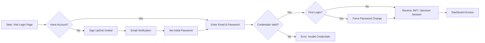

# Authentication & Account Management - F-001

## Overview
- **Status:** GA
- **Primary Users:** super_admin, professional, teacher, lead_specialist, guardian, student
- **Dependencies:** None
- **Related Endpoints:** `/api/auth/login`, `/api/auth/verify-email`, `/api/auth/reset-password`

## User Stories
- As a user, I want to securely log into the platform so that I can access my designated entity data.
- As a guardian, I want to authenticate using a mobile app via an API key so that I can submit triage data from my phone.
- As a new user, I want to receive an email to verify my account and set my password so that my account is securely initialized.
- As a user who forgot my password, I want to request a reset link so that I can regain access.

## UI/UX Flow

