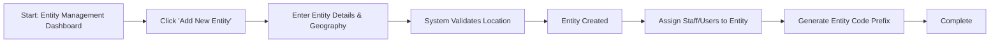

# Entity (School / Organisation) Management - F-002

## Overview
- **Status:** GA
- **Primary Users:** super_admin
- **Dependencies:** F-019 (Geographic Tools)
- **Related Endpoints:** `/api/entities/*`

## User Stories
- As a super_admin, I want to create new school entities and assign geographic coordinates so that the platform can map data accurately.
- As a super_admin, I want to configure an entity code prefix so that student codes are generated with the correct school identifier.
- As a super_admin, I want to assign professionals to specific entities so that they only see their organization's students.
- As a super_admin, I want to view aggregate statistics for all entities so that I can monitor platform usage.

## UI/UX Flow

