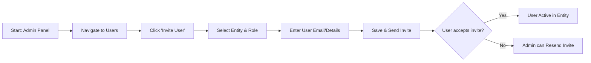

# User Management - F-003

## Overview
- **Status:** GA
- **Primary Users:** super_admin
- **Dependencies:** F-001 (Authentication), F-002 (Entity Management)
- **Related Endpoints:** `/api/users/*`

## User Stories
- As a super_admin, I want to create, edit, and soft-delete users per entity so that I can manage staff access.
- As a super_admin, I want to assign roles (professional, teacher, etc.) to users so that their access is correctly scoped.
- As a super_admin, I want to designate a lead_specialist per entity so that there is an administrator for the waiting list.
- As an admin, I want to resend welcome emails so that users who missed their invitation can log in.

## UI/UX Flow

