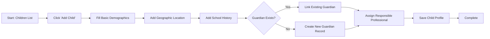

# Student (Child) Registration - F-004

## Overview
- **Status:** GA
- **Primary Users:** professional, teacher, super_admin
- **Dependencies:** F-002 (Entity Management), F-018 (Academic Management)
- **Related Endpoints:** `/api/cadastro/children/*`

## User Stories
- As a teacher, I want to register a new student with their demographic details so that they have a profile in the system.
- As a professional, I want to track a student's school history (grade, classroom, language) so that I have context for their academic performance.
- As a professional, I want to link a child to a guardian profile so that I can contact their parents.
- As a user, I want to be able to soft-delete a student record if added by mistake, and restore it if needed.

## UI/UX Flow

