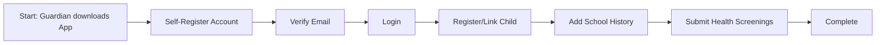

# Guardian Registration (App + Web) - F-005

## Overview
- **Status:** GA
- **Primary Users:** guardian, professional
- **Dependencies:** F-004 (Student Registration)
- **Related Endpoints:** `/api/guardians/*`, Mobile Auth endpoints

## User Stories
- As a guardian, I want to download the mobile app and self-register so that I can submit my child's health screenings.
- As a guardian, I want to link my account to my children so that I can view their data and progress.
- As a professional, I want to create guardian accounts from the web dashboard so that I can add parents who don't have smartphones.

## UI/UX Flow

