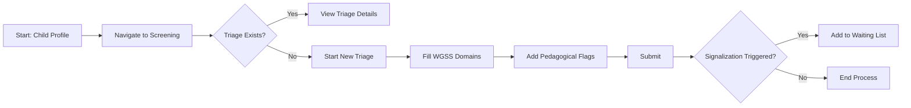

# Screening / Triagem (WGSS + Pedagogical) - F-006

## Overview
- **Status:** GA
- **Primary Users:** professional, teacher, guardian
- **Dependencies:** F-004 (Student Registration)
- **Related Endpoints:** `/api/triagems/*`

## User Stories
- As a professional, I want to submit a WGSS screening for a student so that functional difficulties can be officially recorded.
- As a guardian, I want to fill out health screenings via the mobile app so that the school has my child's baseline data.
- As a professional, I want the system to enforce exactly one triage per child so that records are not duplicated.
- As a teacher, I want to raise pedagogical flags during triage so that non-clinical difficulties are also documented.

## UI/UX Flow

