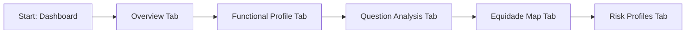

# Universal Triage Analytics Dashboard - F-007

## Overview
- **Status:** GA
- **Primary Users:** professional, lead_specialist, super_admin
- **Dependencies:** F-006 (Screening / Triagem)
- **Related Endpoints:** `/api/dashboards/triage/*`

## User Stories
- As an administrator, I want to view an overview of KPIs across my entity so that I understand our screening coverage.
- As a professional, I want to see functional profiles broken down by disability domains so that I can identify prevalent needs.
- As a lead specialist, I want to view a geographic equity map so that I can visualize where at-risk children reside.
- As a user, I want to view risk profile distributions so that I can allocate resources effectively.

## UI/UX Flow

