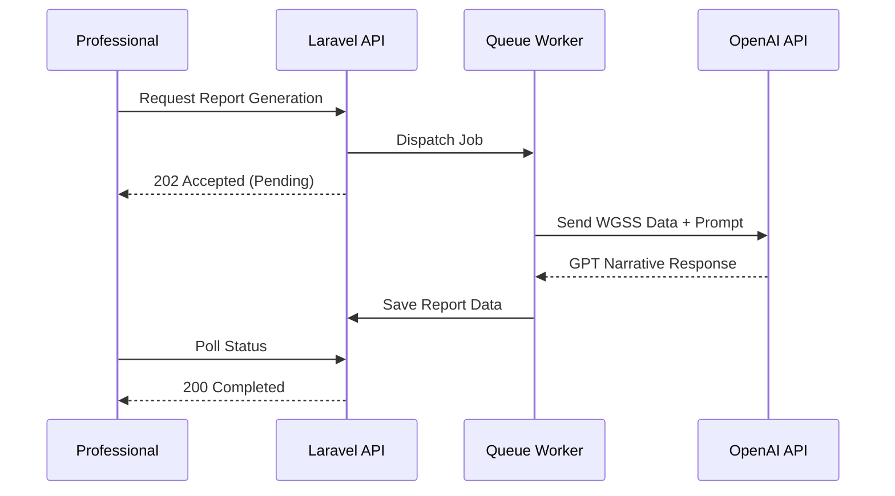

# AI Triage Reports - F-008

## Overview
- **Status:** Beta
- **Primary Users:** professional, lead_specialist
- **Dependencies:** F-006 (Screening / Triagem)
- **Related Endpoints:** `/api/screening/triage-ai-report/child/{id}`

## User Stories
- As a specialist, I want to generate an AI narrative report for a child's triage data so that I can quickly understand the clinical picture.
- As a user, I want the AI to detect cross-section patterns (e.g., mobility + autonomy) so that deeper clinical insights are surfaced automatically.
- As a user, I want report generation to happen asynchronously so that my UI is not blocked.

## UI/UX Flow

