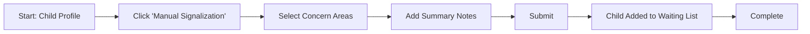

# Manual Signalization - F-009

## Overview
- **Status:** GA
- **Primary Users:** professional, teacher
- **Dependencies:** F-004 (Student Registration), F-011 (Waiting List)
- **Related Endpoints:** `/api/signalizations/*`

## User Stories
- As a professional, I want to manually signalize a child outside the standard WGSS triage flow so that urgent concerns can be logged immediately.
- As a teacher, I want to add summary notes to a manual signalization so that specialists understand the context of my concern.
- As a user, I want manual signalizations to feed directly into the waiting list so that they follow the standard intervention pipeline.

## UI/UX Flow

