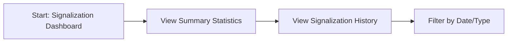

# Signalization Dashboard - F-010

## Overview
- **Status:** GA
- **Primary Users:** professional, lead_specialist
- **Dependencies:** F-006 (Screening / Triagem), F-009 (Manual Signalization)
- **Related Endpoints:** `/api/dashboards/signalizations/*`

## User Stories
- As a professional, I want to view a history of all signalizations for my entity so that I can track our overall intervention volume.
- As a lead specialist, I want to view summary statistics of signalizations so that I can report on the caseload.

## UI/UX Flow

