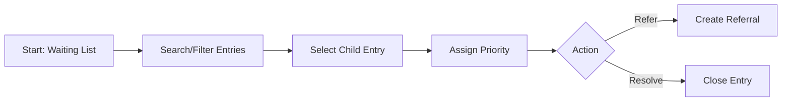

# Waiting List - F-011

## Overview
- **Status:** GA
- **Primary Users:** lead_specialist
- **Dependencies:** F-006 (Screening / Triagem), F-009 (Manual Signalization)
- **Related Endpoints:** `/api/waiting-list/*`

## User Stories
- As a lead specialist, I want to view and prioritize the waiting list of signalized children so that the most urgent cases receive intervention first.
- As a lead specialist, I want to assign priority levels (low/medium/high) to entries so that my team knows who to attend to.
- As a lead specialist, I want to search the waiting list server-side so that I can quickly find specific cases.
- As a lead specialist, I want to close or resolve entries so that the list only shows active cases.

## UI/UX Flow

