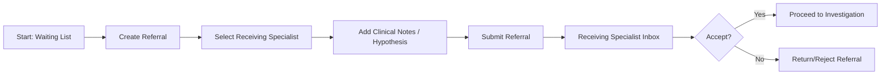

# Referrals (Specialist-to-Specialist) - F-012

## Overview
- **Status:** GA
- **Primary Users:** professional, lead_specialist
- **Dependencies:** F-011 (Waiting List)
- **Related Endpoints:** `/api/referrals/*`

## User Stories
- As a lead specialist, I want to create referrals from one professional to another so that a child can be evaluated by the right expert.
- As a professional, I want to check my referral inbox so that I know which children have been assigned to me.
- As a professional, I want to link a referral to a diagnostic hypothesis and add clinical notes so that the receiving specialist has context.
- As a professional, I want to return or reject a referral if it was incorrectly assigned to me.

## UI/UX Flow

