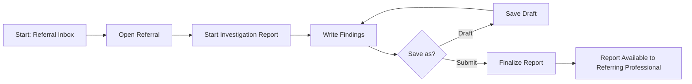

# Referral Investigation Reports - F-013

## Overview
- **Status:** GA
- **Primary Users:** professional, lead_specialist
- **Dependencies:** F-012 (Referrals)
- **Related Endpoints:** `/api/referral-reports/*`

## User Stories
- As a specialist, I want to write investigation reports on received referrals so that I can document my findings.
- As a specialist, I want to save a report as a draft so that I can complete it later.
- As a professional, I want to view completed investigation reports so that I can understand the outcome of a referral.

## UI/UX Flow

