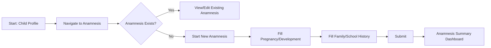

# Anamnesis (Clinical History) - F-014

## Overview
- **Status:** GA
- **Primary Users:** professional, lead_specialist
- **Dependencies:** F-004 (Student Registration)
- **Related Endpoints:** `/api/anamnesis/*`

## User Stories
- As a professional, I want to fill out a structured anamnesis form for a child so that their clinical history is formally recorded.
- As a professional, I want to document pregnancy, development, family, and school history in sectioned data so that the anamnesis is thorough.
- As a user, I want the system to ensure only one valid anamnesis exists per child to maintain data integrity.

## UI/UX Flow

