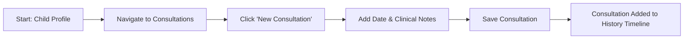

# Consultations - F-015

## Overview
- **Status:** GA
- **Primary Users:** professional, lead_specialist
- **Dependencies:** F-004 (Student Registration)
- **Related Endpoints:** `/api/consultations/*`

## User Stories
- As a professional, I want to log clinical consultations per child so that every interaction is recorded.
- As a professional, I want to link consultations to my professional account so that there is an audit trail.
- As a specialist, I want to view a full student history including triage, anamnesis, and past consultations so that I have complete context during my sessions.

## UI/UX Flow

