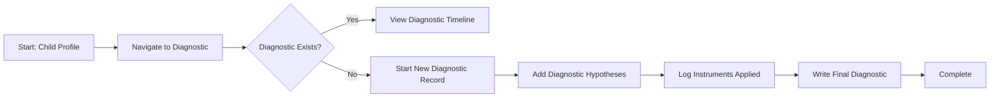

# NEE Diagnostic Process - F-016

## Overview
- **Status:** GA
- **Primary Users:** professional, lead_specialist
- **Dependencies:** F-014 (Anamnesis)
- **Related Endpoints:** `/api/diagnostics/*`

## User Stories
- As a specialist, I want to create a diagnostic record for a child so that formal NEE (Necessidades Educativas Especiais) conclusions are documented.
- As a specialist, I want to add multiple diagnostic hypotheses per specialty so that complex cases are fully mapped.
- As a specialist, I want to log the diagnostic instruments applied so that the rationale for the diagnosis is clear.
- As a professional, I want to view a timeline of clinical events so that I understand the progression of the diagnostic process.

## UI/UX Flow

