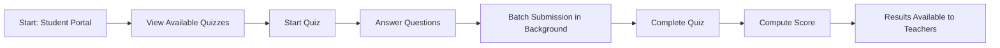

# Assessment (Tests & Quizzes) - F-017

## Overview
- **Status:** Beta
- **Primary Users:** student, professional, teacher, super_admin
- **Dependencies:** F-002 (Entity Management)
- **Related Endpoints:** `/api/assessments/*`

## User Stories
- As an admin, I want to create tests and exercises so that students can be assessed.
- As an admin, I want to publish or unpublish tests globally or per entity so that I control availability.
- As a student, I want to log in and take a quiz so that my performance is evaluated.
- As a student, I want my answers to be submitted in batches so that offline-first resilience prevents data loss.
- As a teacher, I want to view the computed scores and results viewer so that I can grade the students.

## UI/UX Flow

