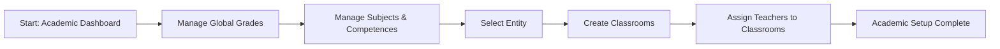

# Academic Management - F-018

## Overview
- **Status:** GA
- **Primary Users:** super_admin
- **Dependencies:** None
- **Related Endpoints:** `/api/academic/*`

## User Stories
- As a super_admin, I want to manage global class grades so that the academic structure is standardized.
- As a super_admin, I want to manage classrooms per entity and assign teachers so that students can be organized locally.
- As a super_admin, I want to configure subjects, subject bases, skills, and competences so that pedagogical data is complete.

## UI/UX Flow

