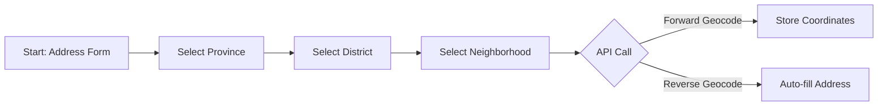

# Geographic Tools - F-019

## Overview
- **Status:** GA
- **Primary Users:** super_admin, professional, teacher, guardian
- **Dependencies:** None
- **Related Endpoints:** `/api/location/*`

## User Stories
- As a user, I want to access a public list of provinces and districts so that I can provide my geographic location during registration.
- As an authenticated user, I want to select from a list of neighborhoods so that my address is precise.
- As the system, I want to forward geocode addresses to coordinates and reverse geocode coordinates to addresses so that spatial data is accurate for maps.

## UI/UX Flow

