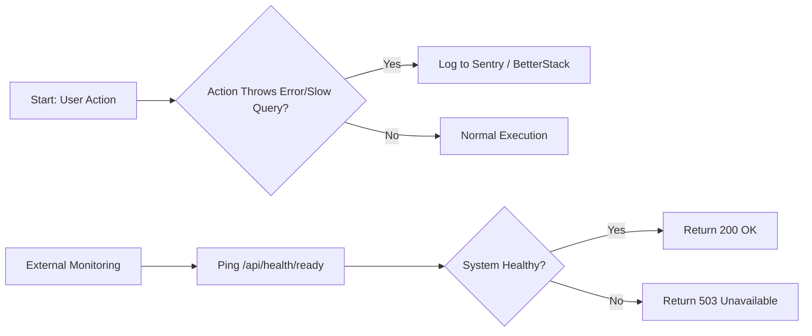

# Observability - F-020

## Overview
- **Status:** GA
- **Primary Users:** super_admin
- **Dependencies:** None
- **Related Endpoints:** `/api/health/ready`

## User Stories
- As a system administrator, I want errors tracked in Sentry so that frontend and backend bugs are logged automatically.
- As a system administrator, I want log aggregation in BetterStack so that I can monitor system behavior centrally.
- As a system administrator, I want slow database queries to be logged automatically so that performance bottlenecks can be identified.
- As a monitoring service, I want to ping a health check endpoint so that I know the system is operational.

## UI/UX Flow

