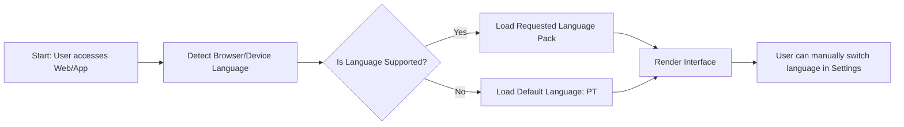

# Internationalisation (i18n) - F-021

## Overview
- **Status:** GA
- **Primary Users:** all roles
- **Dependencies:** None
- **Related Endpoints:** N/A (Client-side / API responses)

## User Stories
- As a user, I want the system to be available in Portuguese (PT) primarily, so that local users can understand the interface.
- As a user, I want the system to be available in English (EN) secondarily, so that international stakeholders can use it.
- As a user, I want the system to automatically detect my language via the browser so that my experience is seamless.

## UI/UX Flow

