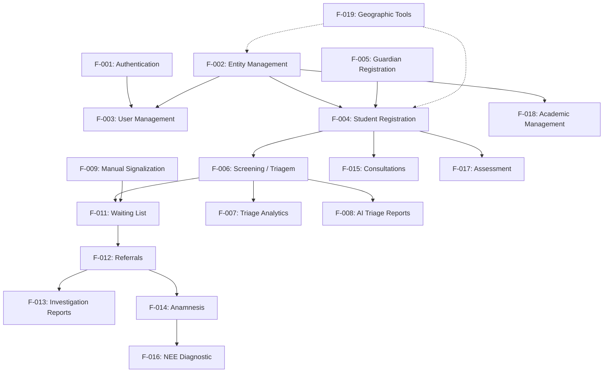

# Features Index

This directory contains the comprehensive documentation suite for all core features in the **Dondzalandia** platform (PLASIR).

## Feature Catalog & Maturity Matrix

| Feature ID | Feature Name | Status |
|---|---|---|
| [F-001](./F-001-authentication.md) | Authentication & Account Management | GA |
| [F-002](./F-002-entity-management.md) | Entity (School / Organisation) Management | GA |
| [F-003](./F-003-user-management.md) | User Management | GA |
| [F-004](./F-004-student-registration.md) | Student (Child) Registration | GA |
| [F-005](./F-005-guardian-registration.md) | Guardian Registration (App + Web) | GA |
| [F-006](./F-006-screening-triagem.md) | Screening / Triagem (WGSS + Pedagogical) | GA |
| [F-007](./F-007-triage-analytics-dashboard.md) | Universal Triage Analytics Dashboard | GA |
| [F-008](./F-008-ai-triage-reports.md) | AI Triage Reports | Beta |
| [F-009](./F-009-manual-signalization.md) | Manual Signalization | GA |
| [F-010](./F-010-signalization-dashboard.md) | Signalization Dashboard | GA |
| [F-011](./F-011-waiting-list.md) | Waiting List | GA |
| [F-012](./F-012-referrals.md) | Referrals (Specialist-to-Specialist) | GA |
| [F-013](./F-013-referral-investigation-reports.md) | Referral Investigation Reports | GA |
| [F-014](./F-014-anamnesis.md) | Anamnesis (Clinical History) | GA |
| [F-015](./F-015-consultations.md) | Consultations | GA |
| [F-016](./F-016-nee-diagnostic.md) | NEE Diagnostic Process | GA |
| [F-017](./F-017-assessment.md) | Assessment (Tests & Quizzes) | Beta |
| [F-018](./F-018-academic-management.md) | Academic Management | GA |
| [F-019](./F-019-geographic-tools.md) | Geographic Tools | GA |
| [F-020](./F-020-observability.md) | Observability | GA |
| [F-021](./F-021-internationalisation.md) | Internationalisation (i18n) | GA |

## Role-Based Access Matrix

| Feature | super_admin | professional | teacher | lead_specialist | guardian | student |
|---|:---:|:---:|:---:|:---:|:---:|:---:|
| F-001: Authentication | ✅ | ✅ | ✅ | ✅ | ✅ | ✅ |
| F-002: Entity Management | ✅ | ❌ | ❌ | ❌ | ❌ | ❌ |
| F-003: User Management | ✅ (Global) | ❌ | ❌ | ❌ | ❌ | ❌ |
| F-004: Student Registration | ✅ | ✅ | ✅ | ✅ | ❌ | ❌ |
| F-005: Guardian Registration | ✅ | ❌ | ❌ | ❌ | ✅ | ❌ |
| F-006: Screening (WGSS) | ✅ | ✅ | ✅ | ✅ | ✅ | ❌ |
| F-007: Triage Dashboard | ✅ | ✅ | ✅ | ✅ | ❌ | ❌ |
| F-008: AI Triage Reports | ✅ | ✅ | ❌ | ✅ | ❌ | ❌ |
| F-009: Manual Signalization | ✅ | ✅ | ✅ | ✅ | ❌ | ❌ |
| F-010: Signalization Dashboard | ✅ | ✅ | ✅ | ✅ | ❌ | ❌ |
| F-011: Waiting List | ✅ | ❌ | ❌ | ✅ | ❌ | ❌ |
| F-012: Referrals | ✅ | ✅ | ❌ | ✅ | ❌ | ❌ |
| F-013: Investigation Reports | ✅ | ✅ | ❌ | ✅ | ❌ | ❌ |
| F-014: Anamnesis | ✅ | ✅ | ❌ | ✅ | ❌ | ❌ |
| F-015: Consultations | ✅ | ✅ | ❌ | ✅ | ❌ | ❌ |
| F-016: NEE Diagnostic Process | ✅ | ✅ | ❌ | ✅ | ❌ | ❌ |
| F-017: Assessment | ✅ | ✅ | ✅ | ✅ | ❌ | ✅ |
| F-018: Academic Management | ✅ | ❌ | ❌ | ❌ | ❌ | ❌ |
| F-019: Geographic Tools | ✅ | ✅ | ✅ | ✅ | ✅ | ❌ |
| F-020: Observability | ✅ | ❌ | ❌ | ❌ | ❌ | ❌ |
| F-021: Internationalisation | ✅ | ✅ | ✅ | ✅ | ✅ | ✅ |

## Cross-Feature Dependencies

