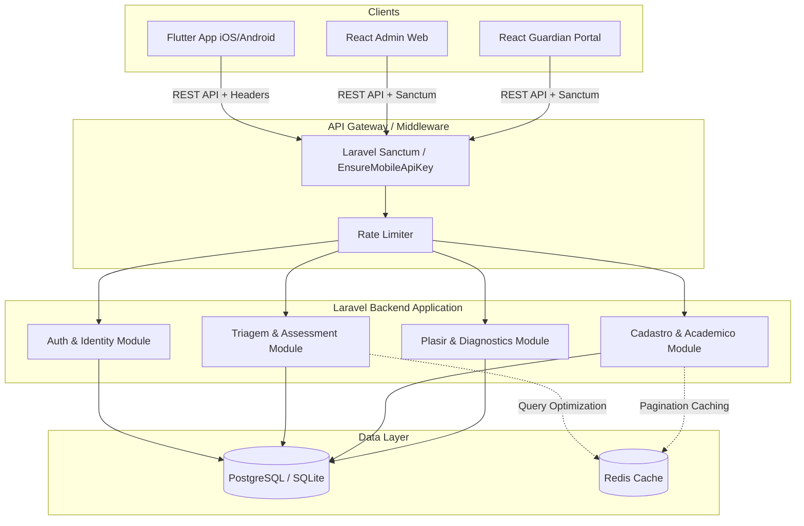

# Donzalandia: Production Ticket Generation & Codebase Audit

## 1. Categories/Areas Summary

Based on a thorough static analysis of the Donzalandia codebase (`/Uno` Flutter App, `/dondza` Laravel Backend, and `/dondza_cadastro` React Admin), the following core issues have been identified:

### 🔴 Security & Authentication
- **Flutter App (`/Uno`)**: Lacks SSL Pinning, making it vulnerable to MITM attacks. Token refresh logic is rigid and needs standard error handling for seamless session restoration.
- **Backend (`/dondza`)**: Hardcoded API keys and basic token matching (`EnsureMobileApiKey.php`) are used instead of granular scoping or ephemeral tokens. Rate limiting is basic. No payload encryption for sensitive medical data.

### 🟠 Performance & Optimization
- **Flutter App (`/Uno`)**: Deep component trees with heavy `StreamBuilder` and `setState` usage. Assessment lists load all data at once instead of using lazy loading or pagination, leading to ~15s load times. Image caching strategy is missing, risking OOM (Out of Memory) crashes.
- **Backend (`/dondza`)**: N+1 queries exist in some complex models (e.g., deeply nested relationships in `TriageIndexQueryService` filtering logic). Inadequate pagination enforcement for bulk endpoints.
- **React Admin (`/dondza_cadastro`)**: Lack of list virtualization for heavy data tables.

### 🟡 Architecture & Code Quality
- **Flutter App (`/Uno`)**: Singleton abuse in service layers. Legacy patterns intertwined with newer features. Error handling lacks standard boundaries.
- **Backend (`/dondza`)**: Business logic sometimes leaks into the Controller layer instead of staying strictly within `UseCases` or `Services`. 

### 🟢 Infrastructure & DevOps
- **CI/CD**: No automated pipelines for testing, building, or deployment.
- **Testing**: Heavy reliance on unit and widget tests, with a complete gap in Integration and E2E testing (Flutter and React) and API Contract testing (Laravel).

---

## 2. Architecture Diagram

---

## 3. 40 GitHub Issues

### Security & Compliance (SEC)
1. **[SEC-001] [App] Implement SSL Pinning in Dio Client**
   - **Severity**: P0
   - **Problem**: Traffic can be intercepted via MITM attacks, exposing sensitive medical data.
   - **Root Cause**: Missing `SecurityContext` and certificate pinning in `lib/core/api/api_service.dart`.
   - **Acceptance Criteria**: App rejects connections with invalid or spoofed certificates.

2. **[SEC-002] [Backend] Rotate Hardcoded Mobile API Keys**
   - **Severity**: P0
   - **Problem**: `EnsureMobileApiKey.php` relies on a static `.env` key which is highly insecure if leaked.
   - **Root Cause**: `config('app.mobile_api_key')` is used for global auth bypassing/verification.
   - **Acceptance Criteria**: Implement HMAC signing or scoped temporary tokens for mobile API authentication.

3. **[SEC-003] [App] Secure Storage for JWT Tokens**
   - **Severity**: P1
   - **Problem**: Tokens might be accessible on rooted/jailbroken devices.
   - **Root Cause**: `AuthManager` relies on plain or insufficiently encrypted local storage.
   - **Acceptance Criteria**: Migrate all token storage to `flutter_secure_storage` with strict access controls.

4. **[SEC-004] [Backend] Implement Payload Encryption for Medical Records**
   - **Severity**: P1
   - **Problem**: Diagnoses and screening data are stored in plain text in the DB.
   - **Root Cause**: Lack of at-rest and application-level encryption for sensitive columns in `Triagem` models.
   - **Acceptance Criteria**: Apply Eloquent attribute encryption (`encrypted:array` / `encrypted`) for medical data.

5. **[SEC-005] [Backend] Strict Rate Limiting on Authentication Routes**
   - **Severity**: P1
   - **Problem**: Endpoints like `/api/auth/login` are vulnerable to brute force.
   - **Root Cause**: `throttle:auth-login` might be too permissive (default Laravel limits).
   - **Acceptance Criteria**: Set strict 5-attempt limit per minute with exponential backoff.

### Performance & Stability (PERF)
6. **[PERF-001] [App] Implement Pagination for Triagem Lists**
   - **Severity**: P0
   - **Problem**: Assessment lists load all data at once, causing 15-second load times and UI freezes.
   - **Root Cause**: Missing `Limit` and `Offset` handlers in frontend repositories and ListViews.
   - **Acceptance Criteria**: Triagem screens use `PagedListView` (from `infinite_scroll_pagination`) fetching 20 items per page.

7. **[PERF-002] [App] Refactor `setState` to Targeted Rebuilds**
   - **Severity**: P1
   - **Problem**: Complex screens stutter during scrolling and input due to full widget tree rebuilds.
   - **Root Cause**: Overuse of `setState()` in top-level parent widgets in `/lib/screens/`.
   - **Acceptance Criteria**: Use `ValueNotifier`, `BlocBuilder`, or `Consumer` to limit rebuilds to specific child nodes.

8. **[PERF-003] [Backend] Resolve N+1 Queries in `TriageIndexQueryService`**
   - **Severity**: P1
   - **Problem**: Filtering triages loops through records, firing redundant queries for nested relationships.
   - **Root Cause**: Dynamic relationship loading inside the collection map instead of optimal Eager Loading.
   - **Acceptance Criteria**: Query analyzer shows < 5 database hits per API call for the Triage Index endpoint.

9. **[PERF-004] [App] Implement Aggressive Image Caching**
   - **Severity**: P1
   - **Problem**: Repeatedly downloading avatars and assessment assets causes network spikes and OOM crashes.
   - **Root Cause**: Standard `Image.network` usage without a dedicated cache manager.
   - **Acceptance Criteria**: Implement `cached_network_image` with defined cache size limits and TTL.

10. **[PERF-005] [React] List Virtualization for Dashboard Tables**
    - **Severity**: P2
    - **Problem**: Admin dashboard lags when displaying hundreds of users/entities.
    - **Root Cause**: Rendering massive HTML tables in DOM directly.
    - **Acceptance Criteria**: Implement `@tanstack/react-virtual` for data-heavy views.

11. **[PERF-006] [Backend] Redis Caching for Global Location Data**
    - **Severity**: P2
    - **Problem**: Fetching provinces/districts constantly hits the database.
    - **Root Cause**: `LocationController` queries directly.
    - **Acceptance Criteria**: Cache location results in Redis indefinitely, invalidating only on admin updates.

12. **[PERF-007] [Backend] Optimize Triagem Dashboard Stats Query**
    - **Severity**: P2
    - **Problem**: `getStats` in Triage Dashboard computes metrics on the fly using DB aggregations.
    - **Root Cause**: Lack of materialized views or pre-computed counter caches.
    - **Acceptance Criteria**: Implement cache or counter columns for triage statistics.

13. **[PERF-008] [App] Dio Interceptor for Request Deduplication**
    - **Severity**: P2
    - **Problem**: Rapid user taps trigger identical parallel API calls.
    - **Root Cause**: No request throttling or deduplication in `ApiService`.
    - **Acceptance Criteria**: Implement an interceptor to cancel or queue identical concurrent requests.

### Architecture & Refactoring (ARCH)
14. **[ARCH-001] [App] Migrate from Singletons to GetIt/Injectable**
    - **Severity**: P1
    - **Problem**: Hard-to-test code and memory leaks due to static service instances.
    - **Root Cause**: Extensive use of `Service.instance` patterns.
    - **Acceptance Criteria**: All services are registered and resolved via `GetIt`.

15. **[ARCH-002] [App] Standardize Error Boundaries & Exception Handling**
    - **Severity**: P1
    - **Problem**: API errors crash the app or show raw exception strings to users.
    - **Root Cause**: Catch blocks throwing generic exceptions straight to the UI.
    - **Acceptance Criteria**: Implement an `AppException` wrapper and a global error handler widget.

16. **[ARCH-003] [Backend] Decouple Triage Filtering Logic**
    - **Severity**: P2
    - **Problem**: `TriageIndexQueryService.php` is over 240 lines of dense query builder logic.
    - **Root Cause**: Mixing permission checks, filter application, and custom macro logic.
    - **Acceptance Criteria**: Refactor filters into dedicated Pipeline classes or Eloquent Query Scopes.

17. **[ARCH-004] [App] Separate Domain Models from DTOs**
    - **Severity**: P2
    - **Problem**: Data models tightly couple API JSON structures to UI state.
    - **Root Cause**: `triagem_models.dart` acts as both Network DTO and Domain Entity.
    - **Acceptance Criteria**: Create strict mapping functions (`toDomain()`, `fromDTO()`).

18. **[ARCH-005] [Backend] Standardize API Resource Transformers**
    - **Severity**: P2
    - **Problem**: Inconsistent JSON payload shapes returned to the frontend.
    - **Root Cause**: Controllers returning raw Eloquent collections instead of Laravel Resources.
    - **Acceptance Criteria**: All controllers use `JsonResource` classes to serialize data.

19. **[ARCH-006] [React] Consolidate JWT Utility Methods**
    - **Severity**: P3
    - **Problem**: Token decoding and expiration checks are spread across multiple hooks and `utils.js`.
    - **Root Cause**: Organic growth of auth context.
    - **Acceptance Criteria**: Centralize all JWT logic into a single heavily tested utility class.

20. **[ARCH-007] [App] Implement Type-Safe Navigation**
    - **Severity**: P2
    - **Problem**: Magic strings used for route names lead to runtime crashes on typos.
    - **Root Cause**: Basic `Navigator.pushNamed` usage without constants.
    - **Acceptance Criteria**: Migrate to `GoRouter` with `go_router_builder` for strongly typed routes.

### Testing & Reliability (TEST)
21. **[TEST-001] [App] Implement Global Crash Reporting**
    - **Severity**: P0
    - **Problem**: Production crashes are invisible to the team.
    - **Root Cause**: Missing Crashlytics/Sentry integration.
    - **Acceptance Criteria**: Integrate Firebase Crashlytics and log all unhandled exceptions.

22. **[TEST-002] [Backend] API Contract Testing with PHPUnit**
    - **Severity**: P1
    - **Problem**: Backend changes occasionally break the Flutter app silently.
    - **Root Cause**: Lack of automated contract/feature tests for `/api` routes.
    - **Acceptance Criteria**: Core auth and triage endpoints have PHPUnit tests asserting JSON schemas.

23. **[TEST-003] [App] Setup Integration Testing for Authentication Flow**
    - **Severity**: P1
    - **Problem**: Login failures regress during refactoring.
    - **Root Cause**: Only unit tests exist.
    - **Acceptance Criteria**: Write `integration_test` covering Login, Token Refresh, and Logout.

24. **[TEST-004] [React] E2E Tests for Admin Dashboard**
    - **Severity**: P2
    - **Problem**: Admin portal critical paths break during updates.
    - **Root Cause**: Missing E2E coverage.
    - **Acceptance Criteria**: Implement Cypress or Playwright tests for Entity and User creation flows.

25. **[TEST-005] [App] Implement Offline-First Resilience for Triagem**
    - **Severity**: P2
    - **Problem**: Assessments lose data if connection drops midway.
    - **Root Cause**: Directly posting to API without local queuing.
    - **Acceptance Criteria**: Assessments save to local Hive/Isar DB and sync when the connection is restored.

### DevOps & CI/CD (DEV)
26. **[DEV-001] [CI/CD] Automated Flutter Build Pipeline**
    - **Severity**: P0
    - **Problem**: Manual builds slow down the weekly release cycle and cause human error.
    - **Root Cause**: No GitHub Actions/Bitrise setup for the `/Uno` folder.
    - **Acceptance Criteria**: GitHub Action runs flutter analyze, tests, and builds APK/IPA on PRs.

27. **[DEV-002] [CI/CD] Automated Laravel Deployment Pipeline**
    - **Severity**: P1
    - **Problem**: Backend deployments are manual and prone to downtime.
    - **Root Cause**: No automated deployment script.
    - **Acceptance Criteria**: Pipeline runs `composer install`, `php artisan migrate`, and clears cache automatically on merge to main.

28. **[DEV-003] [CI/CD] React App Auto-Deploy to Vercel/Netlify**
    - **Severity**: P1
    - **Problem**: Inconsistent staging environment for admin tools.
    - **Root Cause**: Manual builds.
    - **Acceptance Criteria**: Commits to `main` automatically deploy to the production hosting environment.

29. **[DEV-004] [CI/CD] Automated API Documentation Generation**
    - **Severity**: P3
    - **Problem**: Flutter devs don't know when API contracts change.
    - **Root Cause**: Missing OpenAPI/Scribe automation.
    - **Acceptance Criteria**: Laravel `scribe:generate` runs in CI and publishes to a static docs page.

30. **[DEV-005] [CI/CD] Database Migration Rollback Drills**
    - **Severity**: P2
    - **Problem**: Bad migrations cannot be easily reverted in production.
    - **Root Cause**: Lack of defined rollback strategies and tests.
    - **Acceptance Criteria**: Add CI step to run `migrate:rollback` and verify schema integrity.

### Feature & UX Polish (UX)
31. **[UX-001] [App] Skeleton Loaders for Assessment Screens**
    - **Severity**: P2
    - **Problem**: Users stare at a blank screen or static spinner during 15s loads.
    - **Root Cause**: Using `CircularProgressIndicator` for full page loads.
    - **Acceptance Criteria**: Implement `shimmer` effect matching the assessment card layout.

32. **[UX-002] [App] Form Auto-Save Indicator**
    - **Severity**: P3
    - **Problem**: Users don't know if their long assessment data is saved.
    - **Root Cause**: Silent background saves.
    - **Acceptance Criteria**: Add a non-intrusive "Saved just now" micro-interaction on the app bar.

33. **[UX-003] [React] Toast Notification Standardization**
    - **Severity**: P3
    - **Problem**: Success/error messages vary in design across the portal.
    - **Root Cause**: Mixed usage of `alert()` and custom components.
    - **Acceptance Criteria**: Centralize notifications using `react-hot-toast` or Notistack.

34. **[UX-004] [App] Deep Linking for Referrals**
    - **Severity**: P2
    - **Problem**: Notification taps open the home screen instead of the specific referral.
    - **Root Cause**: Routing doesn't parse intents/deep links.
    - **Acceptance Criteria**: App intercepts URL scheme and navigates directly to the Assessment detail view.

35. **[UX-005] [App] Pull-to-Refresh on Dashboards**
    - **Severity**: P2
    - **Problem**: Users must restart the app to see new assigned triages.
    - **Root Cause**: Missing `RefreshIndicator`.
    - **Acceptance Criteria**: Implement `RefreshIndicator` wrapping the main ListViews.

### Code Quality (CQ)
36. **[CQ-001] [Backend] Enable PHPStan Strict Types**
    - **Severity**: P2
    - **Problem**: Type juggling causes subtle bugs in data formatting.
    - **Root Cause**: Lack of `declare(strict_types=1);` and loose typing in older controllers.
    - **Acceptance Criteria**: PHPStan Level 5 passes successfully on the codebase.

37. **[CQ-002] [App] Enforce Strict Dart Analyzer Rules**
    - **Severity**: P2
    - **Problem**: Inconsistent formatting and potential null safety misses.
    - **Root Cause**: `analysis_options.yaml` is missing or uses weak rules.
    - **Acceptance Criteria**: Apply `flutter_lints` and resolve all warnings.

38. **[CQ-003] [React] Enforce ESLint & Prettier Hooks**
    - **Severity**: P2
    - **Problem**: Code styling arguments in PRs.
    - **Root Cause**: No pre-commit hooks.
    - **Acceptance Criteria**: Setup Husky and lint-staged to auto-format before commit.

39. **[CQ-004] [Backend] Prune Unused Dependencies**
    - **Severity**: P3
    - **Problem**: `composer.json` is bloated.
    - **Root Cause**: Legacy packages left behind.
    - **Acceptance Criteria**: Audit and remove unused Laravel packages.

40. **[CQ-005] [App] Extract Hardcoded Strings to i18n/l10n**
    - **Severity**: P3
    - **Problem**: Difficult to fix typos or translate the app.
    - **Root Cause**: Strings hardcoded directly in Widgets.
    - **Acceptance Criteria**: Implement `flutter_localizations` and `.arb` files for all user-facing text.

---

## 4. 4-Sprint Roadmap

**Sprint 1: Stability & Security Foundations (Weeks 1-2)**
- Setup Firebase Crashlytics & Sentry for error tracking.
- Implement SSL Pinning in Flutter and Payload Encryption in Backend.
- Resolve API Key hardcoding vulnerabilities.
- Implement pagination for Triagem lists to immediately alleviate 15s load times.

**Sprint 2: Architecture Refactoring & Caching (Weeks 3-4)**
- Resolve N+1 queries in the Triage Query Service.
- Migrate Flutter app to GetIt (Dependency Injection) to stop memory leaks.
- Implement aggressive image caching (`cached_network_image`).
- Add Redis caching for static global endpoints (Location/Provinces).

**Sprint 3: Automation & Resilience (Weeks 5-6)**
- Setup GitHub Actions for Flutter, Laravel, and React.
- Implement offline-first syncing capabilities (Hive/Isar) in Flutter.
- Write Integration tests for core auth flows.
- Implement list virtualization in the React dashboard.

**Sprint 4: UX Polish & Code Quality (Weeks 7-8)**
- Implement Skeleton loaders and Pull-to-refresh.
- Add deep linking for push notifications.
- Enforce strict typing, linting, and pre-commit hooks across all 3 codebases.
- Standardize Error boundaries and Toast notifications.

---

## 5. Top 10 Quick Wins (1-2 Day Tasks, High Impact)

1. **Implement `PagedListView`** on the main Triage screens. (Instantly fixes the 15s freeze).
2. **Setup Firebase Crashlytics** (Provides immediate visibility into production crashes).
3. **Add `cached_network_image`** wrapper around existing image components.
4. **Implement Redis caching** for the `/location/provinces` and districts endpoints.
5. **Rotate `MOBILE_API_KEY`** and implement a strict rate limiter on the login endpoint.
6. **Add `RefreshIndicator`** to all main lists in the app so users don't have to restart.
7. **Wrap heavy list items in `const`** constructors where applicable to reduce Flutter rebuilds.
8. **Eager Load (`with()`)** relations correctly in the Triage Dashboard queries to stop basic N+1s.
9. **Add Skeleton Loaders** (Shimmer effect) to improve perceived performance.
10. **Centralize Dio Interceptors** to catch 401s and attempt graceful token refreshes automatically.
